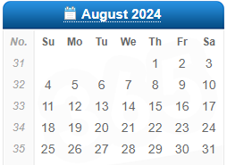

## My daily plan

### 当前

### Week 33

- [ ] 备课C++（执行5，已完成4）
- [ ] 整理已有的EEG代码，步骤，完成预处理（执行）
- [ ] 学习心理学—与来访者交谈（执行）
- [ ] 学习DIY嵌入式设备（计划）

### Week 34

- [ ] 备课嵌入式（执行，已计划2）
- [ ] 整理已有的EEG代码，步骤，完成预处理（执行）
- [ ] 学习架构设计师的书籍（计划）
- [ ] 学习DIY嵌入式设备（计划）
- [ ] 学习心理学—与来访者交谈（执行）

### 中期计划

- [ ] 学习架构设计师的书籍（计划）
- [ ] 学习AI（计划）

Sample: 
- [x] Greeting

Helper:
日历：https://www.calendar-365.com/week-number.html

