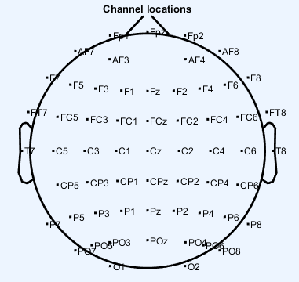
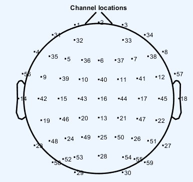

# EEG事件记录表

## EEG-GB

| 信号/分组 | 分组信号 | 时间偏差                 | 描述                                      |
| --------- | -------- | ------------------------ | ----------------------------------------- |
| 250       |          |                          | welcome欢迎                               |
| 1         |          |                          | Relaxt5分钟提示                           |
| 230       |          | 5mins                    | Relax 5分钟                               |
| 231       |          |                          | Beep                                      |
| 232       |          |                          |                                           |
| 20        |          |                          | PracticeHints，练习                       |
| 21        |          |                          | +                                         |
| (1)       | 22       |                          | PracticeTextOption                        |
| (1)       | 24       |                          | PracticeFeedBackText                      |
| (2)       | 26       |                          | PracticePicOption                         |
| (2)       | 28       |                          | PracticeFeedBackText                      |
| 150       |          |                          | TestHintsBF实验前提示，开始第一阶段的实验 |
| (1)       | 154      | 300                      | +                                         |
| (1)       | 156      | 200                      | PicTrigger(图片启动图片)                  |
| (1)       | 158      | 100                      | TextBlank                                 |
| (1)       | 160      | 3000 or feedback         | Feedback on Pic                           |
| (1)       | 163      | wait until answer        | 评价Feedback                              |
| (1)       | 220      | 200-400                  | 随机空白                                  |
| (2)       | 154      | 300                      | +                                         |
| (2)       | 156      | 200                      | PicTrigger(图片启动文字)                  |
| (2)       | 158      | 100                      | TextBlank                                 |
| (2)       | 180      | 3000 or feedback         | Feedback on Text                          |
| (2)       | 163      | wait until answer        | 评价Feedback                              |
| (2)       | 220      | 200-400                  | 随机空白                                  |
| (3)       | 154      | 300                      | +                                         |
| (3)       | 196      | 200                      | TextTrigger(文字启动图片)                 |
| (3)       | 158      | 100                      | TextBlank                                 |
| (3)       | 160      | 3000 or feedback         | Feedback on Pic                           |
| (3)       | 163      | wait until answer        | 评价Feedback                              |
| (3)       | 220      | 200-400                  | 随机空白                                  |
| (4)       | 154      | 300                      | +                                         |
| (4)       | 196      | 200                      | TextTrigger(文字启动文字)                 |
| (4)       | 158      | 100                      | TextBlank                                 |
| (4)       | 180      | 3000 or feedback         | Feedback on Text                          |
| (4)       | 163      | wait until answer        | 评价Feedback                              |
| (4)       | 220      | 200-400                  | 随机空白                                  |
| 200       |          | 30000                    | 小憩                                      |
| 151       |          | wait until pressed a key | 等待确认进入冥想或放松练习                |
| （1）     | 3        |                          | 放松提示                                  |
| （1）     | 4        | 26mins                   | 放松练习                                  |
| （2）     | 5        |                          | 冥想提示                                  |
| （2）     | 6        | 26mins                   | 冥想练习                                  |
| 233       |          |                          | 结束冥想/放松                             |
| 11        |          | 1sec                     | Beep                                      |
| 234       |          |                          | End Beep                                  |
| 50        |          | wait until pressed a key | 开始第二阶段的实验                        |
| (1)       | 54       | 300                      | +                                         |
| (1)       | 56       | 200                      | PicTrigger(图片启动图片)                  |
| (1)       | 58       | 100                      | TextBlank                                 |
| (1)       | 60       | 3000 or feedback         | Feedback on Pic                           |
| (1)       | 63       | wait until answer        | 评价Feedback                              |
| (1)       | 220      | 200-400                  | 随机空白                                  |
| (2)       | 54       | 300                      | +                                         |
| (2)       | 56       | 200                      | PicTrigger(图片启动文字)                  |
| (2)       | 58       | 100                      | TextBlank                                 |
| (2)       | 80       | 3000 or feedback         | Feedback on Text                          |
| (2)       | 63       | wait until answer        | 评价Feedback                              |
| (2)       | 220      | 200-400                  | 随机空白                                  |
| (3)       | 54       | 300                      | +                                         |
| (3)       | 96       | 200                      | TextTrigger(文字启动图片)                 |
| (3)       | 58       | 100                      | TextBlank                                 |
| (3)       | 60       | 3000 or feedback         | Feedback on Pic                           |
| (3)       | 63       | wait until answer        | 评价Feedback                              |
| (3)       | 220      | 200-400                  | 随机空白                                  |
| (4)       | 54       | 300                      | +                                         |
| (4)       | 96       | 200                      | TextTrigger(文字启动文字)                 |
| (4)       | 58       | 100                      | TextBlank                                 |
| (4)       | 80       | 3000 or feedback         | Feedback on Text                          |
| (4)       | 63       | wait until answer        | 评价Feedback                              |
| (4)       | 220      | 200-400                  | 随机空白                                  |
| 201       |          | 30000                    | 小憩                                      |
| 152       |          |                          | 结束                                      |


### 数据处理过程

| 简述                             | 内容       |
| -------------------------------- | ---------- |
| gb-004的前实验有一个s196的重叠值 | 删除重叠值 |
| gb-008                           | 无数据     |
|                                  |            |

### 数据处理状态

| 编号       | 处理结果   | 备注                           |
| ---------- | ---------- | ------------------------------ |
| GB-001     | 预处理结束 |                                |
| GB-002     | 预处理结束 |                                |
| GB_003     | 预处理结束 | 无5分钟静息数据                |
| gb_eeg_003 |            |                                |
| GB_004     | 预处理结束 | 无5分钟静息数据                |
| GB_005     | 预处理结束 | ICA后的分段尚缺                |
| GB_006     | ——         | 数据不对，可能是其他人的数据。 |
| GB_007     | 预处理结束 |                                |
| GB_008     | 预处理结束 |                                |
| GB_009     |            | 无数据                         |
| GB_010     | 预处理结束 |                                |
| GB_011     | 预处理结束 |                                |
| GB_012     |            |                                |
| GB_013     |            |                                |
| GB_014     |            | 无数据                         |
| GB_015     |            | 无数据                         |
| GB_016     |            |                                |
| GB_017     |            | 无数据                         |
| GB_018     |            |                                |
| GB_019     |            |                                |
| GB_020     |            |                                |
|            |            |                                |
|            |            |                                |
|            |            |                                |
|            |            |                                |
|            |            |                                |
|            |            |                                |
|            |            |                                |
|            |            |                                |
|            |            |                                |
|            |            |                                |
|            |            |                                |
|            |            |                                |
|            |            |                                |
|            |            |                                |
|            |            |                                |
|            |            |                                |
|            |            |                                |
|            |            |                                |
|            |            |                                |
|            |            |                                |
|            |            |                                |
|            |            |                                |
|            |            |                                |
|            |            |                                |
|            |            |                                |
|            |            |                                |
|            |            |                                |
|            |            |                                |
|            |            |                                |
|            |            |                                |
|            |            |                                |
|            |            |                                |
|            |            |                                |
|            |            |                                |
|            |            |                                |
|            |            |                                |
|            |            |                                |
|            |            |                                |


## EEG-GXZ

| 信号/分组 | 时间           | 描述 |
| --------- | -------------- | ---- |
| （1）     | 300            | +    |
| （1）     | 1000           | 刺激 |
| （1）     | 200-400        | 随机 |
| （2）     | 300            | +    |
| （2）     | until response | 反馈 |

范围：-0.5 - 1.5

信号：

```
前：
1,2，3,4, 5, 6,
后：
7,8，9,10,11,12，
```

冥想：

```
205：提示
206：开始
210：结束
```

放松：

```
200：提示
201：开始
210：结束
```

更正：采用后面的事件向前后各推1s。即：

```
前:
s11,s12
s21,s22
s31,s32
s41,s42
s51,s52
s61,s62
后：
s71,s72
s81,s82
s91,s92
s101,s102
s111,s112
s121,s122
```

### 数据处理状态

| 编号    | 处理情况   | 备注     |
| ------- | ---------- | -------- |
| gxz-001 | 预处理结束 |          |
| gxz-002 | 预处理结束 |          |
| gxz-003 | 分段结束   | 尚未叠加 |
|         |            |          |
|         |            |          |
|         |            |          |
|         |            |          |
|         |            |          |
|         |            |          |
|         |            |          |
|         |            |          |
|         |            |          |
|         |            |          |
|         |            |          |
|         |            |          |
|         |            |          |
|         |            |          |
|         |            |          |
|         |            |          |
|         |            |          |
|         |            |          |
|         |            |          |
|         |            |          |
|         |            |          |
|         |            |          |
|         |            |          |
|         |            |          |
|         |            |          |
|         |            |          |
|         |            |          |
|         |            |          |
|         |            |          |
|         |            |          |
|         |            |          |
|         |            |          |
|         |            |          |
|         |            |          |
|         |            |          |
|         |            |          |
|         |            |          |
|         |            |          |
|         |            |          |
|         |            |          |
|         |            |          |
|         |            |          |
|         |            |          |
|         |            |          |
|         |            |          |
|         |            |          |
|         |            |          |
|         |            |          |
|         |            |          |
|         |            |          |
|         |            |          |
|         |            |          |
|         |            |          |
|         |            |          |
|         |            |          |
|         |            |          |


# 其他

## 名称

前额：Frontal pole，Fp1、Fp2

侧额：Inferior Frontal，F7、F8

额：Frontal，F3、Fz、F4

颞：Temporal，T3(T7)、T4(T8)

中央：Central，C3、Cz、C4

后颞：Posterior temporal，T5(P7)、T6(P8)

顶：Parietal，P3、Pz、P4

枕：Occipital，O1、O2

耳：Auricular，A1、A2





# ERP成分

## 早期成分

**时间**：刺激开始后200ms以内的电位变化。

**特征**：具有通道特异性。视觉、听觉、诱发电位均有不同特征。

**视觉**：通常包括C1、颞枕区的P1和N1/N170，额中央区的N1和P2。

### C1成分

- 通常在头皮后部中线或偏侧电极位置幅度最大；
- 它会随着视觉刺激呈现的位置而发生变化，如下视野的刺激诱发的C1为正性，上视野的刺激诱发的C1为负性；水平视野中线的刺激可能只诱发很小的正性C1或没有明显的C1;
- C1通常开始于刺激呈现后40~60ms，峰值潜伏期约为80 ~ 100ms，不同的实验的结果有时会有不同；
- C1对刺激的物理属性非常敏感，如对比度、亮度、空间频率等，但不受注意的影响；
- 溯源分析发现C1产生于初级视皮层V1(纹状皮质)；

### P1、N1注意效应

- 在颞枕区，C1之后紧跟着P1成分，通常在偏枕区（如O1、O2）幅度最大，峰值潜伏期为100ms左右，但受到刺激对比度的显著影响。
- 头皮后部的P1，N1以及额区的N1均受注意的显著影响，表现为幅值的增加；
- 头皮后部分布的P1和头前部分布的N1，均受到注意的影响，但不是一个成分的极性反转，二者反映了不同的心理生理机制；

### P2

- 额中央区的N1成分之后，有一个显著的正成分，潜伏期为200ms左右，即为P2。该成分和靶刺激的早期识别有关，往往伴随着头皮后部的N2b的产生。
- 头皮前部分布的P2a和头皮后部分布的N2b具有不同的机制。N2b通常和任务以及刺激频率相关，但P2a反映的只是与任务相关的加工。
- 头皮后部，N1之后有一个明显的正成分或者正走向的潜伏期在200 ~ 300ms的P2。在复杂视觉刺激如面孔和文字的ERP研究中，头皮后部P2的潜伏期往往在250ms左右，因此也有研究将其称为P250，该成分与头皮前部的P2具有不同机制，可能与视觉信息的早期语义加工有关。

### N170/VPP

在颞枕区（特别是右侧颞枕区），面孔诱发出比对其他非面孔物体更大的负波，该负波在刺激呈现后170ms左右达到峰值，故称为N170。普遍认为，N170反映了面孔特异性的早期知觉加工，即面孔和非面孔的区别。（通常电极T5/P7、T6/P8）

当以双侧乳突或耳垂记录以及转换为平均参考时，面孔刺激产生显著的额中央区分布（VPP）【Fz,P9,P10】成分，潜伏期为刺激呈现后150 ~ 200 ms。由于VPP和N170具有相同性质，且具有相同皮层发生源，因此VPP可能属于N170在额区的极性反转。

为了防止视觉刺激的撤反应对N170的影响，**视觉刺激的呈现时间通常采用200 ~ 300 ms**，即N170出现后刺激图片消失。基于N170的脑区分布特性（分布于颞枕区），通常采用鼻尖，双侧耳垂（Eimer的实验）或者**离线转换为平均参考**（Rossion的实验）。应该重点观察和分析颞枕区的电极（P7/P8、PO7/PO8、P9/P10），而不是枕部（如O1/O2）。统计分析时，**需要将半球（左、右）作为一个因素进行方差分析**。

同时，其前的**P1**也需要注意，以确定N170的差异是否基于P1的变化。另外，采用双侧耳垂或乳突为参考电极时，对**VPP进行测量和分析也是完全必要的**。