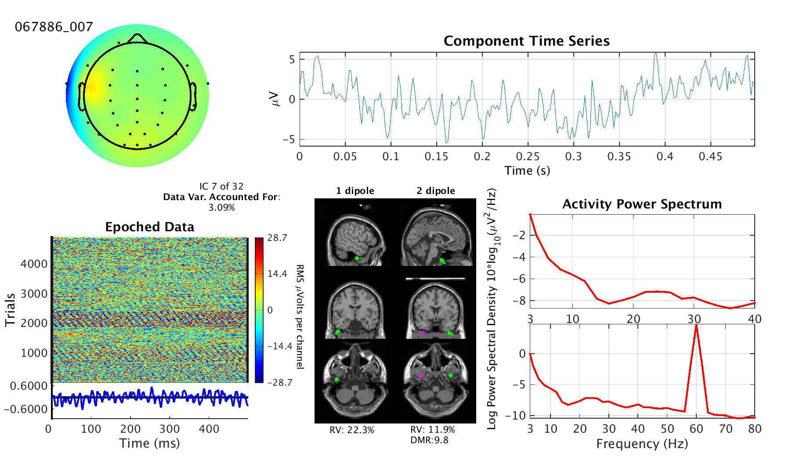
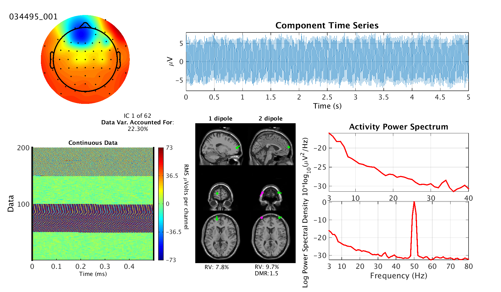

## EEG Processing

### Preprocessing

#### ICA Process

ICA是利用机器学习的算法，对EEG数据进行成分分解。它是将所有训练数据都考虑在内，当训练数据中留下太多类型的噪声—复杂的运动伪影、电极坏道等，这些坏数据特征将对ICA分解会产生影响。因此，向 ICA 提供尽可能多的干净 EEG 数据才是最佳的。（剔除较大的明显的伪迹数据）

一般来说，**建议对连续数据使用 ICA，而不是已提取的分段数据**。首先，分段数据已经减少了样本数量，当存在更多数据时，ICA 成分的质量会更高些。其次，删除分段数据的基线会对ICA 产生重大影响，因为它会在每个通道中引入随机偏移，这是 ICA 无法建模或补偿的。虽然可以提取分段时不删除基线，但是在运行 ICA 之后，基线可能会被删除。

将 ICA 应用于分段数据也是可能的。ICA 期望数据是平稳的，即相同的统计模型正在生成所有数据样本。如果您在 分段之后有足够的数据，那么分段数据可能更可取，因为它会更加稳定。但是，在对不同事件进行分段以生成不同数据集时，我们建议对所有条件使用相同的 ICA 分解。实际上，这可能意味着在运行 ICA 之前创建一个包含所有分段类型的数据集。假设所有数据在统计上相似，更多的数据通常会提供更好的 ICA 分解。更长的时期更可取，因为它们为 ICA 产生更多数据（假设平稳性成立。）

ICA步骤：

1. Tools->Decompose data By ICA

2. Tools->Classify components using ICLable->Label components
3. Tools → Classify components using ICLabel → Flag components as artifacts

##### 成分判断

###### 成分判断：**眨眼成分**

判断依据：

1.在头皮地形图的前端分布；

2.ERP图像中有小方块；

3.随机分布；

4.功率谱图中，低频能量高；

5.成分排序较为靠前，像这个示例中，为IC3

颜色的深浅有意义，但是红还是蓝无所谓，大红大蓝都可以的。

###### 成分判断：**眼动成分**

判断依据：

1.在头皮地形图的前端两侧分布，红蓝相对；

2.在ERP图像中，长条状，红蓝相间；

3.随机分布；

4.在功率谱图中低频能量高

5.分量排序靠前，但一般在眨眼后面，在该示例中为IC5.

###### 成分判断：**头动成分**

判断依据：

1.在头皮地形图中分布在周围；

2.在ERP图像中呈现长条状；

3.随机分布；

4.在单个trial里有非常明显(非常长)的飘移。

###### 成分判断：**心电成分**

判断依据：

1.在ERP图像中呈雨点般散落状。

###### 成分判断：**工频干扰**

判断依据：

1.头皮地形图显示分布在地线周围；

2.在ERP图像中单个trail上的分布非常规律；

3.在功率谱图中，50Hz左右能量最高(有剧烈的峰值)。

ICA判断网站，若是对ICA成分不熟悉，可以看看这个网站的介绍

https://labeling.ucsd.edu/tutorial/labels

##### Brain Component 大脑成分

- Scalp topography often looks dipolar
	头皮地形通常看起来是偶极的
- Residual variance from dipole fit (marked RV on images) should be low. Usually below 15% unless the component is better explained with two dipoles
	偶极子拟合（在图像上标记为 RV）的残差应较低。通常低于 15%，除非用两个偶极子更好地解释该分量
- Power spectrum decreases as frequency increased (1/f)
	功率谱随着频率的增加而降低 （1/f）
- Power spectrum usually has peaks between 5 and 30 Hz, most often at 10 Hz
	功率谱的峰值通常在 5 到 30 Hz 之间，最常见的是 10 Hz
- Epoched data will likely have a visible ERP
	划时代数据可能具有可见的 ERP

###### 1）例1：正常案例

This component is clearly fit by a single dipole located in the brain, both by the scalp topography and by the dipole plot. The power spectrum also suggests a brain source because of the peak at 10 Hz. This is continuous data, so there is no ERP (although there needn't always be one either).
该组件显然适合位于大脑中的单个偶极子，无论是头皮地形还是偶极子图。功率谱也表明了脑源，因为峰值为 10 Hz。这是连续的数据，所以没有ERP（尽管也不一定总是有ERP）。

###### 2）例2：正常案例

This component is also well fit by a single dipole located in the brain, but is deeper in the brain than would be expected (visible in the dipole plot). Component depth is the least accurate part of dipole location estimates because of the dependence on accurate tissue conductivity values. The power spectrum also suggests a brain source because of the peak at 7 Hz.
该组件也与位于大脑中的单个偶极子很好地拟合，但在大脑中的深度比预期的要深（在偶极子图中可见）。由于依赖于准确的组织电导率值，因此组件深度是偶极子位置估计中最不准确的部分。功率谱也表明了脑源，因为峰值为 7 Hz。

###### 3）例3：正常案例

This component is not as "clean" as the first two, but is still clearly a brain component as seen from the strong 10 Hz peak, 9% residual variance of the single dipole model, and roughly dipolar scalp topography. As the data is epoched, you can also see a clear event related potential in the ERP image.
这个组件不像前两个那样“干净”，但从强大的 10 Hz 峰值、单偶极子模型的 9% 残差和大致的偶极头皮地形图来看，它仍然很明显是大脑组件。随着数据的显示，您还可以在ERP图像中看到与事件相关的明确潜力。

###### 4）例4：特殊案例

**Special Case**: The scalp topography of this component and high residual variances clearly indicate that this is not a brain component. However, the strong ERP visible in the ERP Image and the powerful 10 Hz peak in the power spectrum are strongly indicative of a brain component. Therefore it could be correct to mark both "Brain" and "Other" for this component as they are both highly likely to apply. Likewise, "Other" alone is also a reasonable label as it is quite odd. As a side note, a possible explanation for this component may be that the channel location information is incorrectly registered in this dataset.
特殊情况：该成分的头皮地形和高残差清楚地表明这不是大脑成分。然而，ERP图像中可见的强ERP和功率谱中强大的10 Hz峰值强烈表明了大脑成分。因此，为该组件同时标记“大脑”和“其他”可能是正确的，因为它们都极有可能适用。同样，“其他”本身也是一个合理的标签，因为它很奇怪。顺便说一句，此组件的可能解释可能是通道位置信息在此数据集中未正确注册。

##### Eye Component 眼睛组件

- Scalp topographies suggest "equivalent current dipole"（ECDs） near eyes
	头皮地形图提示眼睛附近有等效电流偶极子（ ECD）
- Power concentrated at low frequencies (below 5 Hz)
	功率集中在低频（低于 5 Hz）
- Vertical eye movement components will contain blinks in the data
	垂直眼动组件将在数据中包含眨眼
- Horizontal eye movement components will look like step functions
	水平眼动组件看起来像步进函数

###### 1）例1：眨眼

This components captures the effects of eye blinks. This is most clearly visible in the time series plot but can also be seen in the ERP Image. The scalp topography shows that the component affects the electrodes around the eyes, roughly equally. More evidence for this is the high data variance accounted for and the lack of peaks in the power spectrum. Two dipoles fit the scalp topography significantly better than just one and they are located near the eyes. It is a bit odd that they appear above the eyes, but that could potentially be error in the electrical model.
该组件捕获眨眼的效果。这在时间序列图中最为明显，但在 ERP 映像中也可以看到。头皮形貌显示，该成分对眼睛周围的电极的影响大致相同。这方面的更多证据是考虑到高数据方差和功率谱中缺乏峰值。两个偶极子比只有一个偶极子更适合头皮地形，它们位于眼睛附近。它们出现在眼睛上方有点奇怪，但这可能是电气模型中的错误。

###### 2）例2：眨眼

This components captures the effects of eye blinks. This is primarily visible the time series data, power spectrum, and the scalp topography. The 2-dipole plot shows the dipoles placed *above* the eyes which could indicate that this is not an eye component, but in this case, more likely means that the electrical model as poorly aligned to the electrical model of the subject's head. Another oddity is the ERP Image which suffers from scaling issues caused by high amplitude artifacts, rendering it useless here. Finally, the offset of ~25 micro Volts in the time series is also odd. Nonetheless, this component can still be confidently classified as "Eye".
该组件捕获眨眼的效果。这主要体现在时间序列数据、功率谱和头皮形貌上。2偶极子图显示了放置在眼睛上方的偶极子，这可能表明这不是眼睛的组成部分，但在这种情况下，更可能意味着电气模型与受试者头部的电气模型对齐不良。另一个奇怪的是ERP图像，它遭受了由高振幅伪影引起的缩放问题，使其在这里毫无用处。最后，时间序列中~25微伏的偏移量也是奇怪的。尽管如此，这个组件仍然可以自信地归类为“眼睛”。

###### 3）例3：眼球运动

This components captures the effects of eye movement. In both the time series plot and the ERP Image, you can see clear evidence of saccades by the discontinuities surrounded by relative stationarity. The scalp topography and dipole plot reinforce this interpretation as they indicate that the source origin is in or near the eyes.
该组件捕获眼球运动的影响。在时间序列图和 ERP 图像中，您都可以通过相对平稳性包围的不连续性看到扫视的清晰证据。头皮地形图和偶极子图强化了这种解释，因为它们表明源源在眼睛内或附近。

###### 4）例4：眼球运动

This components captures the effects of horizontal eye movement, although some high frequency power in included from some other source.
该组件捕获了水平眼球运动的影响，尽管包含来自其他来源的一些高频功率。

##### Muscle Component 肌肉成分

- Power concentrated in higher frequencies (20 Hz and above)
	功率集中在较高频率（20 Hz 及以上）
- Can still be dipolar, but will be located outside the skull
	仍然可以是偶极的，但会位于颅骨外

###### 1）例1：肌肉成分

Every plot in this image suggests a muscle component. Dipole plots and the scalp topography indicate a shallow source. The power spectrum has broad-band high frequency power. Lastly, the ERP image shows highly non-stationary activity, typical of changing muscle usage based on body position and activity.
这张图片中的每个图都暗示了肌肉成分。偶极子图和头皮地形图表明源头较浅。功率谱具有宽带高频功率。最后，ERP图像显示了高度非静止的活动，典型的是根据身体姿势和活动改变肌肉使用。

###### 2）例2：肌肉成分

This component is most readily recognized by the power spectrum as it has low amounts of low frequency power and high amounts of broad band high frequency power. The dipoles are also located very close to the outside of the skull. Even though the component has high residual variance, the scalp topography a pattern that can easily be interpreted to be a very shallow dipole.
该分量最容易被功率谱识别，因为它具有少量的低频功率和大量的宽带高频功率。偶极子也非常靠近头骨的外侧。尽管该组件具有很高的残差方差，但头皮形貌的图案很容易被解释为非常浅的偶极子。

###### 3）例3：肌肉成分

This dataset was not detrended before ICA was applied, leading to the unusual looking ERP Image. Nonetheless, it can be comfortably classified as a muscle component from the power spectrum's high frequency power and the "shallow" scalp topography (also visible in the dipole plot).
在应用 ICA 之前，该数据集未被去趋势化，导致 ERP 图像看起来不寻常。尽管如此，它可以很容易地被归类为功率谱的高频功率和“浅”头皮地形（在偶极子图中也可见）的肌肉成分。

###### 4）例4：肌肉成分

As usual, the power spectrum is the leading evidence for a muscle component. In this case, though, the time series shows a district and strong muscle activity burst that is typical of EMG data.
像往常一样，功率谱是肌肉成分的主要证据。然而，在这种情况下，时间序列显示了肌电图数据的典型区域和强烈的肌肉活动爆发。

##### Heart Component 心脏成分

Heart components capture the electrical potentials generated by the heart. This measurement is known as [electrocardiography](https://en.wikipedia.org/wiki/Electrocardiography) (ECG or EKG). The pattern generated by the heart is very typical and is known as a [QRS complex ](https://en.wikipedia.org/wiki/QRS_complex). These should occur at about 1 HZ. because of the distance of the heart, the scalp map will look like that of a very far dipole and so will look almost like a linear gradient.
心脏组件捕获心脏产生的电位。这种测量被称为心电图（ECG 或 EKG）。心脏产生的模式非常典型，称为QRS波群。这些应该发生在大约 1 HZ 的频率下。由于心脏的距离，头皮图看起来像一个非常远的偶极子，因此看起来几乎像一个线性梯度。

- Clear QRS complex in the data at about 1 Hz
	数据中清晰的QRS波群，频率约为1 Hz
- Near linear gradient scalp topography
	近线性梯度头皮形貌
- No peaks in power spectrum
	功率谱中没有峰值

###### 1）例1：心电

A regular QRS complex is immediately visible in the time series plot. The scalp topography is the a wide, roughly linear, gradient as is typical of heart components. It is not perfectly separated, as visible by the activity between the QRS complexes and the spurious peaks in the power spectrum, but it is resolved enough to comfortably call a heart component.
在时间序列图中立即可见规则的 QRS 波群。头皮地形是一个宽阔的、大致线性的梯度，这是心脏成分的典型特征。它并没有完全分离，从QRS波群和功率谱中的杂散峰之间的活动可以看出，但它的分辨率足以舒适地称为心脏分量。

###### 2）例2：心电

Linear scalp map gradient and a clear and regular QRS complex indicate a heart component.
线性头皮图梯度和清晰规则的 QRS 波群提示心脏成分。

###### 3）例3：心电

Linear scalp map gradient and a clear and regular QRS complex indicate a heart component.
线性头皮图梯度和清晰规则的 QRS 波群提示心脏成分。

###### Line Noise 线路噪声

Line noise is contamination from the alternating current that is used to power nearly all lighting fixtures and electronics these days. Depending on where you are, the frequency used can be either 50 Hz or 60 Hz. The datasets we use come from all over and so you can expect to see some of both (but never together). While this noise is typically removed in the data cleaning steps before ICA is applied, ICA may separate out line noise if it has enough channels and data to work with. Line noise components are mostly evident from their sharply peaked power spectrum with the peak at either 50 or 60 Hz. These components are not to be confused with other components that simply have some line noise contaminating them.
线路噪声是交流电的污染，交流电目前用于为几乎所有照明设备和电子设备供电。根据您所在的位置，使用的频率可以是 50 Hz 或 60 Hz。我们使用的数据集来自各地，因此您可以期待看到两者中的一些（但永远不会一起）。虽然这种噪声通常在应用 ICA 之前的数据清理步骤中被消除，但如果 ICA 有足够的通道和数据可供处理，则可以分离出线路噪声。线路噪声分量主要从其峰值功率谱中明显看出，峰值为 50 或 60 Hz。不要将这些组件与其他组件混淆，因为这些组件只是有一些线路噪声污染了它们。

- Strong peak in power spectrum at either 50Hz or 60Hz
	50Hz或60Hz时的功率谱峰值强劲

###### 1）例1：市电噪声

The only real indicator here is that huge peak in the power spectrum at 50 Hz. Of interest, though, is that the source of the line noise is non-stationary as the effects are only present during certain segments of the data as can be seen in the ERP Image. The scalp topography is not informative beyond possibly allowing one to guess the direction of the line-noise source.
这里唯一真正的指标是 50 Hz 功率谱中的巨大峰值。然而，有趣的是，线路噪声的来源是非平稳的，因为这种影响只存在于数据的某些部分，如ERP图像所示。头皮地形除了可能允许人们猜测线路噪声源的方向外，没有提供任何信息。

###### 2）例2：市电噪声

This component, instead, has a strong peak at 60 Hz. The line noise power is well above the rest of the power spectrum, even if it is lower than in the other examples.
相反，该组件在 60 Hz 时具有很强的峰值。线路噪声功率远高于功率谱的其余部分，即使它低于其他示例。

3）例3：市电噪声

This component has a peak at 50 Hz and is the most clearly non-stationary of all the examples.
该分量的峰值为 50 Hz，是所有示例中最明显的非平稳的。

4）例4：市电噪声

Peak at 50 Hz.
峰值为 50 Hz。

##### Channel Noise 信道噪声

If a channel gets bumped a lot during a recording or if it has a poor contact, it will often generate large artifacts that do not affect any other channels. ICA will often separate these out into their own component which we call channel noise components. They can be recognized by their scalp topographies which put almost all the weighting on a single channel.
如果通道在录制过程中受到很大冲击，或者接触不良，它通常会产生不影响任何其他通道的大音损。ICA通常会将这些分量分离成自己的分量，我们称之为信道噪声分量。它们可以通过头皮地形来识别，这些地形几乎将所有权重都放在一个通道上。

These components can be difficulty to classify as often times they can seem very similar to muscle components. The similarity resides mostly in the scalp topography. Telling them apart is primarily accomplished by looking for typical high frequency power typical of muscle components. Channel noise components, on the other hand, typically have a 1/f spectrum.
这些成分可能很难分类，因为它们通常看起来与肌肉成分非常相似。相似之处主要在于头皮地形。区分它们主要是通过寻找肌肉成分的典型高频功率来实现的。另一方面，信道噪声分量通常具有 1/f 频谱。它的特征：

- Very focal scalp topography
	非常局灶性头皮地形图
- Large and/or consistent artifacts in the component activations.
	组件激活中的大和/或一致的伪影。
- Easily confused with muscle components, but PSD is different.
	容易与肌肉成分混淆，但 PSD 不同。

###### 1）例1：信道噪声

The scalp topography is only weighted on a single electrode and the power spectrum is a cleanly decreasing curve. Very typical channel noise component despite a lack of large artifacts in the data.
头皮形貌仅在单个电极上加权，功率谱是一条明显的递减曲线。非常典型的信道噪声分量，尽管数据中缺少较大的伪影。

###### 2）例2：信道噪声

The scalp topography is only weighted on a single electrode and the power spectrum is a cleanly decreasing curve. Very typical channel noise component despite a lack of large artifacts in the data.
头皮形貌仅在单个电极上加权，功率谱是一条明显的递减曲线。非常典型的信道噪声分量，尽管数据中缺少较大的伪影。

###### 3）例3：信道噪声

Very typical channel noise component. 1/f power spectrum and extremely focal scalp topography.
非常典型的信道噪声分量。1/f 功率谱和极其集中的头皮地形。

##### Other 其他

Not all components are meaningful. More specifically: *most* components are *not* meaningful. ICA assumes that there are as many independent components as there electrodes and that is almost never the case. When a component does not converge onto a meaningful signal, it can either capture a mixture of signals or some noise. In rough terms, anything that does not fit the above categories can be deemed "other". Signs of components being in the "other" category would be anything that stands out as very unusual or uncharacteristic of the other categories. Also, the high the "component number" (and therefore the lower the explained variance in the data), the more likely that a component is in the "Other" category. Usually the last half of components can be called "Other". For instance, even if there seems to be a 10 Hz peak in the power spectrum, the component is not necessarily a brain component. If it has a very non-dipolar scalp topography and there is very little
并非所有组件都有意义。更具体地说：大多数组件没有意义。ICA假设有与电极一样多的独立组件，但事实并非如此。当一个分量没有收敛到一个有意义的信号上时，它可以捕获信号的混合或一些噪声。粗略地说，任何不符合上述类别的东西都可以被视为“其他”。组件属于“其他”类别的迹象将是其他类别中非常不寻常或不典型的任何内容。此外，“组件编号”越高（因此数据中解释的方差越低），组件越有可能属于“其他”类别。通常组件的后半部分可以称为“其他”。例如，即使功率谱中似乎存在10 Hz的峰值，该组件也不一定是大脑组件。如果它具有非常非偶极的头皮地形并且几乎没有。

- Anything that doesn't fit the above categories.
	任何不符合上述类别的东西。
- More likely the higher the IC number (as in IC 150 of 220 is *very* likely to be "Other"
	IC 编号越高（如 IC 150 中的 220 很可能是“其他”）
- Non-dipolar scalp maps 非偶极头皮图
- Spectrum can still have weak 10 Hz peak as brain signals are likely mixed with other signals
	频谱仍然可能具有微弱的 10 Hz 峰值，因为大脑信号可能与其他信号混合

###### 1）例1：其他

The two main features that stand out for this component are the splotchy scalp topography and that it is IC 50 of 120. Components with numbers this high have a very low chance of being meaningful. Note that this is an example of how ERPs do not always mean the component is meaningful.
该组件突出的两个主要特征是斑点状头皮地形，并且是 IC 50 的 120。具有如此高数字的组件有意义的可能性非常低。请注意，这是一个示例，说明ERP并不总是意味着该组件是有意义的。

###### 2）例2：其他

The messy scalp topography in conjunction with a lack of peaks in the power spectrum suggest this component is classifiable as "other". The odd step in the power spectrum is likely do to a low pass filter at 25 Hz.
凌乱的头皮形貌加上功率谱中缺乏峰值表明该组件可归类为“其他”。功率谱中奇怪的步骤可能与25 Hz的低通滤波器有关。

###### 3）例3：其他

There are few meaningful clues to extract from the information presented asides from the non-dipolar scalp map. Therefore this component can be deemed other. The amount of 50 Hz power is not enough to deem this a purely "Line Noise" component, but it wouldn't wrong to mark both "Other" and "Line Noise" in this case.
除了非偶极头皮图之外，几乎没有什么有意义的线索可以从提供的信息中提取。因此，此组件可以被视为其他组件。50 Hz 的功率不足以将其视为纯粹的“线路噪声”组件，但在这种情况下同时标记“其他”和“线路噪声”并没有错。

来源：https://labeling.ucsd.edu/tutorial/labels

参考：

1. https://github.com/sccn/ICLabel
2. https://labeling.ucsd.edu/tutorial/labels

##### ICA初次耗时

###### 1）实验1-PostMeditation：

开始时间：15:39

结束时间：16:20

共耗时：40分钟

###### 2）实验2：PreMeditation:

开始时间：16:29

结束时间：17:18

共耗时：约50分钟

###### 3）实验3：全部

开始时间：15:34

结束时间：17:16

共耗时：102分钟

##### 全局ICA后，脑电分布

来源：MX_GXZ_100_2024-05-29_16-36-01_resampled_reref_M1_M2_excluded_hipassed_notch_lopassed_ICA.set

数据比较：

| 通道 | 先ICA，再分段      | 先分段，再ICA(5mins) | 全局ICA(未分段)    |
| ---- | ------------------ | -------------------- | ------------------ |
| 1    | Other:61.9         | **Brain:100**        | Other:66.7         |
| 2    | Other:39.7         | Other:64.2           | Other:38.8         |
| 3    | Other:93.7         | Other:93.7           | Other:98.8         |
| 4    | Other:61.7         | Other:36.3           | Other:95.0         |
| 5    | Brain:88.1         | Other:73.5           | Other:62.2         |
| 6    | **Brain:51.7**     | Other:95.2           | Other:69.1         |
| 7    | **Brain:63.0**     | Other:94.0           | Other:75.4         |
| 8    | **Brain:100**      | Other:96.6           | **Brain:100%**     |
| 9    | **Brain:44.9**     | **Brain:100**        | Other:76.7         |
| 10   | Other:82.7         | Heart:53.9           | Other:93.2         |
| 11   | Channel Noise:47.2 | Other:92.4           | Channel Noise:45.9 |
| 12   | Other:92.5         | Other:83.3           | Other:95.4         |
| 13   | Other:90.4         | Other:89.6           | Other:92.0         |
| 14   | Heart:43.9         | Other:88.3           | Heart:49.2         |
| 15   | Other:97.1         | **Brain:99.9**       | Other:97.8         |
| 16   | **Brain:100**      | Other:82.1           | **Brain:99.9**     |
| 17   | **Brain:99.9**     | Other:68.6           | **Brain:99.5**     |
| 18   | Other:84.3         | Muscle:50.7          | Other:86,4         |
| 19   | **Brain:100**      | **Brain:99.9**       | **Brain:99.9**     |
| 20   | **Brain:81.5**     | Other:95.5           | Other:86.2         |
| 21   | **Brain:39.3**     | Other:72.8           | Other:65.5         |
| 22   | **Brain:99.9**     | Other:92.3           | **Brain:99.7**     |
| 23   | Other:87.6         | Other:59.8           | Other:90.3         |
| 24   | Other:61.1         | **Brain:73.8**       | Other:65.6         |
| 25   | Other:68.2         | Other:89.2           | Other:77.4         |
| 26   | **Brain:52.9**     | Other:83.1           | **Brain:60.7**     |
| 27   | Channel Noise:49.1 | Other:97.4           | Channel Noise:41.5 |
| 28   | **Brain:99.6**     | Other:79.0           | **Brain:99.4**     |
| 29   | Channel Noise:53.3 | **Brain:99.2**       | Channel Noise:56.4 |
| 30   | **Brain:54.3**     | Other:94.6           | Other:50.1         |
| 31   | Other:66.6         | Other:94.0           | Other:90.1         |
| 32   | Other:94.5         | **Brain:99.6**       | Other:94.2         |
| 33   | Other:96.4         | **Brain:59.3**       | Other:95.6         |
| 34   | Other:75.4         | Other:95.7           | Other:78.4         |
| 35   | Other:50.8         | Other:59.0           | Other:62.9         |
| 36   | **Brain:63.5**     | Other:67.2           | Other:49.1         |
| 37   | Other:62.8         | Other:68.2           | Other:64.5         |
| 38   | Other:57.2         | Other:63.7           | Muscle:48.5        |
| 39   | Other:80.3         | Other:72.5           | Other:86.3         |
| 40   | Other:48.8         | **Brain:53.4**       | Other:76.3         |
| 41   | Other:80.0         | Other:98.9           | Other:78.9         |
| 42   | Other:74.7         | **Brain:99.4**       | Other:86.4         |
| 43   | Other:80.7         | **Brain:99.6**       | Other:95.3         |
| 44   | Other:78.6         | **Brain:61.5**       | Other:78.9         |
| 45   | Other:58.2         | **Brain:87.5**       | Other:80.0         |
| 46   | **Brain:91.1**     | Other:81.9           | Other:73.8         |
| 47   | **Brain:29.4**     | Other:80.4           | Channel Noise:28.6 |
| 48   | Other:78.4         | Other:98.7           | Other:83.0         |
| 49   | **Brain:70.3**     | Other:95.2           | Other:81.0         |
| 50   | **Brain:55.4**     | Other:79.9           | **Brain:49.0**     |
| 51   | **Brain:90.7**     | Other:57.4           | Other:49.7         |
| 52   | Other:81.2         | Other:98.4           | Other:70.7         |
| 53   | Other:52.1         | Other:87.4           | Other:64.3         |
| 54   | Other:64.6         | Other:99.2           | Other:74.5         |
| 55   | Other:48.3         | Other:58.7           | Other:47.2         |
| 56   | Other:83.7         | Other:77.2           | Other:83.9         |
| 57   | Other:86.4         | Other:81.8           | Other:84.9         |
| 58   | Other:95.5         | Other:91.4           | Other:97.8         |
| 59   | Channel Noise:44.7 | Other:87.4           | Channel Noise:41.5 |

Brain数(5mins):

1）先ICA，再分段：19

2）先分段，再ICA：13

3）全局ICA(未分段)：8

4）完全吻合：1

5）前两者完全吻合：2（包含3者完全吻合）

#### Preprocessing Results

| 被试           | 数据情况                 | 解释 |
| -------------- | ------------------------ | ---- |
| GB-006         | 缺少（实验前后）实验数据 |      |
| GB-001至GB-031 | 缺少5mins冥想数据        |      |
|                |                          |      |
|                |                          |      |
|                |                          |      |
|                |                          |      |
|                |                          |      |
|                |                          |      |
|                |                          |      |

数据相差500+/-1;

