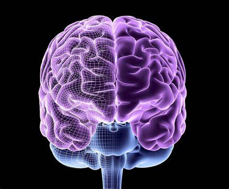

Hello, there! I am Bobo! I really expected to write down something here. If you like computer programming language, DIY things, or psychology things, we can stick together and step ahead if you like!

### 👀My Recent Studies

#### 1. EEG data processing

- Preprocessing [EEG](EEG.md#Preprocessing)
- Resting-Sate EEG [Resting-State](RestingEEG.md)
- Event-related potential[ERP](ERP.md)
- EEG events [Events](EEG-events.md)

### My Recent Articles

[1] [Cyber-Meditation’s Progress In Application](https://10.19738/j.cnki.psy.2024.04.070)

### My Interests

- ⭐️Psychology

	It’s really hard to understand people. Personally, starting from the brain gives us more pictures.

	

- ⭐️Computer Programming

  Since I was 19 years old, I learn the computer stuff, from power on/off, to switches in computer programming language. It gives me more insights of this wide field.

  - [AI](AI.md)

- ⭐️DIY

  When the AI become a part of our life, it is great that we try something meaningful and do it by ourselves .

  - [Basic Circuit Diagram](ICDesign.md)

- ⭐️Management

	Managing things, managing people. Whatever resources you have are possible to be managed by people.

### **📫About Me**

- 🤔Age : **DO NOT ASK A PERSON'S AGE!** But I am above 40

- Tools Skills: Xcode, QT, Android Development Kit

- 👨🏽‍💻Computer Language Skills : C, C++, Objective C, Java, Python, PHP, ASM

- 🌱School : 

	- Master, Master Of Administration, Si Chuan Normal University
	- Master, Applied Psychology, Chengdu Medical College
	- Undergraduate, University of Electronic Science and Technology of China

  

#### **Q/A**

#### 1. How long have I been a developer?

A: Long enough to be a senior senior developer. :-)

#### 2. Do you really love computer languages?

A: Yes, I do. Let’s not just surf on the surface, try deeper.

### My up-to-date works

[Up-To-Date](Current_works.md)